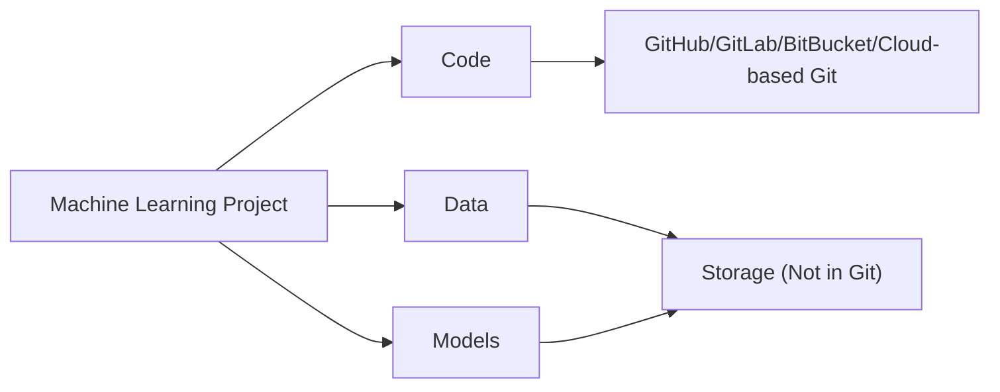
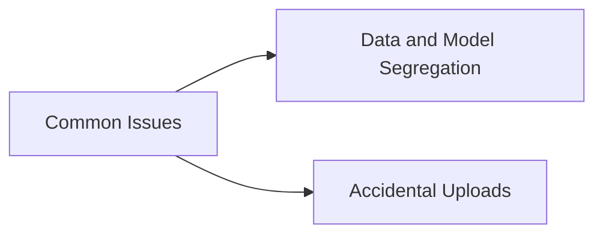
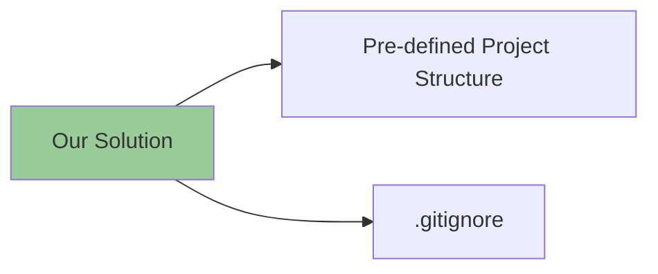

# Python Machine Learning Template

##  🧠 **Philosophy**

> This template is meticulously designed to encapsulate the three core components of a Machine Learning project: **Code**, **Data**, and **Models**. The primary objective is to cohesively organize these components within the project structure, thereby enhancing manageability and maintainability.


- 🔢 **Code**: The codebase is the backbone of your project. It is typically managed through version control and is pushed to a remote repository on platforms such as GitHub, GitLab, BitBucket, or any other cloud-based Git service. This ensures that your work is safely stored and can be shared with others.


- 📊 **Data & Models**: These are the lifeblood of your machine learning project. They should be incorporated within the project structure. However, due to their potentially large file size, they should never be pushed to the git repository. Instead, consider using data version control tools or cloud storage solutions to manage your data and models.


<div align="center">



<b>Intended organization</b>

</div>


### ⚠️ ** Common Challenges** 

Developers often encounter the following problems during the development process:

<!-- <div align="center">



</div> -->

- 🙆 **Data and Model Segregation**: They frequently need to separate data, models, and other artifacts from their code before pushing changes to a remote repository. This process can be time-consuming and error-prone.

- 🤦 **Accidental Uploads**: There's always a risk of inadvertently pushing unwanted files to the remote repository, which can clutter the repository or even expose sensitive data.

### 🎯 **Our Solution** 

This template is designed to mitigate these challenges with the following features:

<!-- <div align="center">


</div> -->


- 🗂️ **Pre-defined Project Structure**: The template offers a well-organized layout to store all your files, data, models, and other artifacts. This structure remains consistent throughout the project's life cycle, promoting a clean and organized development environment.

- 🛡️ **.gitignore**: A carefully crafted .gitignore file is included to ensure that unwanted files are not pushed to the remote repository. This helps to prevent accidental uploads and keeps your repository clean and focused.

____

## 🗂️ **Project Directory Structure**

```

.
├── config/                  <- 📂 Configuration files [.ini, .json, .yaml]
├── data/                    <- 📂 Images, numpy data objects, text files
├── docs/                    <- 📂 Store .md files. Used by Mkdocs for Project Documentation
├── helpers/                 <- 📂 Utility/helper files/modules for the project
├── html/                    <- 📂 Store .html files and accompanying assets. Used by pdoc3 for API Documentation
├── logs/                    <- 📂 Log files generated by the project during execution
├── models/                  <- 📂 Model files [.h5, .pkl, .pt] - pre-trained weight files, snapshots, checkpoints
├── notebooks/               <- 📂 Jupyter Notebooks
├── references/              <- 📂 Data dictionaries, manuals, and all other explanatory materials
├── scripts/                 <- 📂 Utility scripts for various project-related tasks
├── src/                     <- 📂 Source code (.py files)
├── tests/                   <- 📂 Unit tests for the project
├── workspaces/              <- 📂 Multi-user workspace that can be used in the case of a single machine
├── .env-template            <- 🔧 Template for the .env file
├── .gitattributes           <- 🔧 Standard .gitattributes file
├── .gitignore               <- 📛 Standard .gitignore file
├── .pre-commit-config.yaml  <- 🔧 Config file for Git Hooks
├── LICENSE                  <- 🪧 License file [choose your appropriate license from GitHub]
├── mkdocs.yml               <- 🗞️ Base config file required for Mkdocs
├── Pipfile		             <- 🗃️ Most commonly used python packages
├── project_setup.bat        <- 📜 Project script for Windows OS
├── project_setup.sh         <- 📜 Project script for Linux/MacOS
├── README.md                <- 📝 Project readme
├── setup.py                 <- 📦️ For installing & packaging the project
└── tox.ini                  <- 🔧 General-purpose package configuration manager

```

> 🚀 _By adopting this clean and organized project structure, you can enhance accessibility and maintainability, allowing for seamless development and collaboration._

> 👩‍💻 _Give it a try and experience the benefits of a simplified and well-structured project! Happy coding!_ 

____


## **FAQs**

<details>
<summary> <b> 🤔 1. Is this project structure/repository inspired from cookie-cutter project template? </b> </summary>
<ul>

<li>
In short, no. While there may be similarities in naming conventions, the Python Machine Learning Template was created based on the specific needs of machine learning projects, such as reinforcement learning, computer vision, and natural language processing. However, we do appreciate the Jupyter Notebook naming convention used in the cookie-cutter project template and we recommend that users should follow it.
</li>

<li>
Here it is:

Naming convention is a number (for ordering), the creator's initials, and a short `-` delimited description, e.g. `1.0-jqp-initial-data-exploration`. i.e., it follows a format of `<number>-<initials>-<short-description>`, e.g., `1.0-jqp-initial-data-exploration.ipynb`
</li>

</ul>

</details>


____


## 🌟 **Show Your Support**

If our work has benefitted you, we kindly ask you to give it a star on [GitHub](https://github.com/anujonthemove/Python-Machine-Learning-Template) 🤩. Your support serves as a great motivation for us to continue enhancing the project and introducing new features. 💪

We deeply appreciate your support! ❤️
