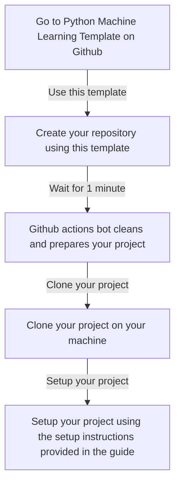

# **Process Flow**

```mermaid

graph TB
  A["Go to Python Machine Learning Template on Github"] -- "Use this template" --> B["Create your repository using this template"]
  B -- "Wait for 1 minute" --> C["Github actions bot cleans and prepares your project"]
  C -- "Clone your project" --> D["Clone your project on your machine"]
  D -- "Setup your project" --> E["Setup your project using the setup instructions provided in the guide"]

```

