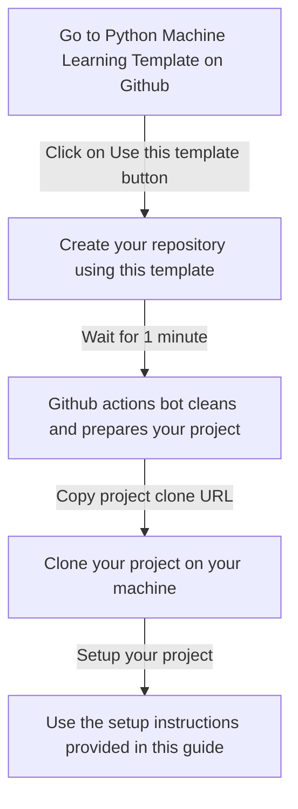
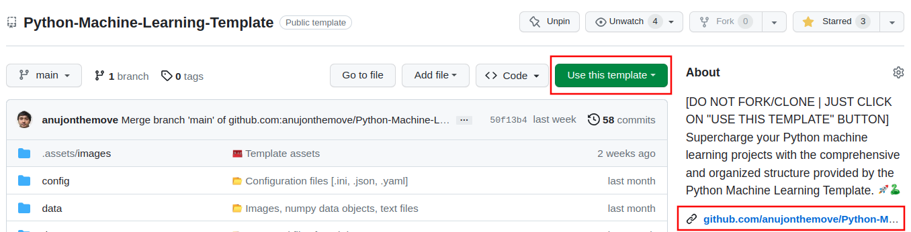
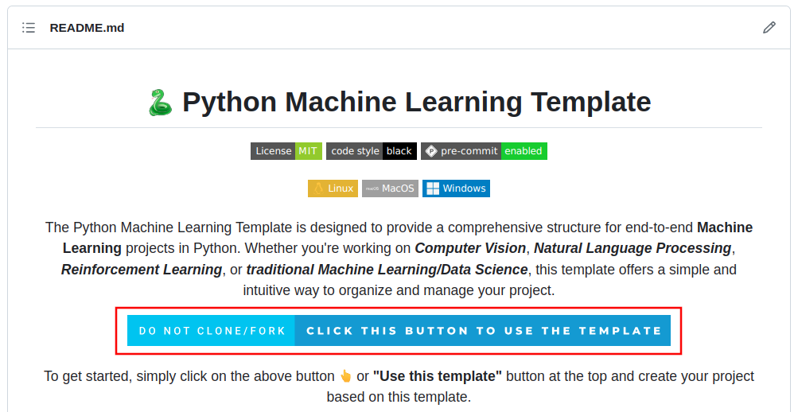

# 🎮 **How to start using this template?**

The Python Machine Learning Template is designed to be user-friendly and easy to start with. 

Here is a simple process flow to get you started:

<b>Process Flow</b>

### **🪜 Step-by-step instructions**

1. Go to [**Python Machine Learning Template**](https://github.com/anujonthemove/Python-Machine-Learning-Template) on Github.

2. Click on "[**Use this template**](https://github.com/anujonthemove/Python-Machine-Learning-Template/generate)" button to create your project. Github provides this feature which allows you to create a new repository using the template.

    !!! info "Option 1"

        <figure markdown>
          { width="1000px" }
          <figcaption><b>Option 1: </b> You can select the highlighed button or link</figcaption>
        </figure>

    **The Readme also contains a button which has the same functionality, it directs you to project creation page.**

    !!! info "Option 2"
        
        <figure markdown>
          { width="1000px" }
          <figcaption><b>Option 2: </b> You can select the highlighed button here as well</figcaption>
        </figure>

3. ***Wait for 1 minute after creating your repository***. During this time, the Github actions bot cleans and prepares your project.

4. Once the Github actions bot has prepared your project, you can clone it onto your machine.

5. After cloning the project, you can set it up using the setup instructions provided in this section.
