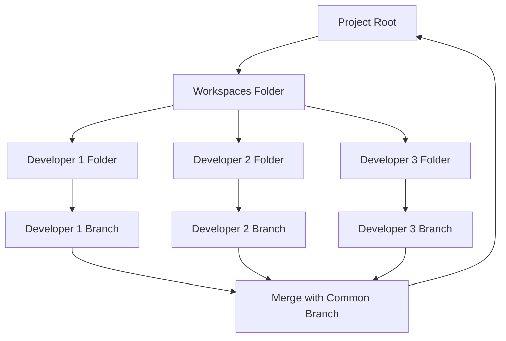

# 👥 **Multi-user Workspace for Collaborative Projects**

The `workspaces` folder is intended for scenarios where multiple people are working on the same project on the same machine.

Inside the `workspaces` folder, you can create subfolders named after each developer, allowing them to clone the project and work on different branches. 

The template has been cleverly configured in a way that git will not track these subdirectories from the root of the project but inside each of the cloned project, git will work normally. This enables multiple people to collaborate on the same project without conflicts. 

To incorporate their individual changes, developers can merge their branches respective branch with a common branch located at the root level.

<b>Using workspaces directory</b>

In this structure, the project root leads to a workspaces folder. This folder contains individual folders for each developer (Developer 1, Developer 2, Developer 3, etc.). Each developer works on their own branch within their respective folder. When they're ready to incorporate their changes, they merge their branch with a common branch located at the root level.

